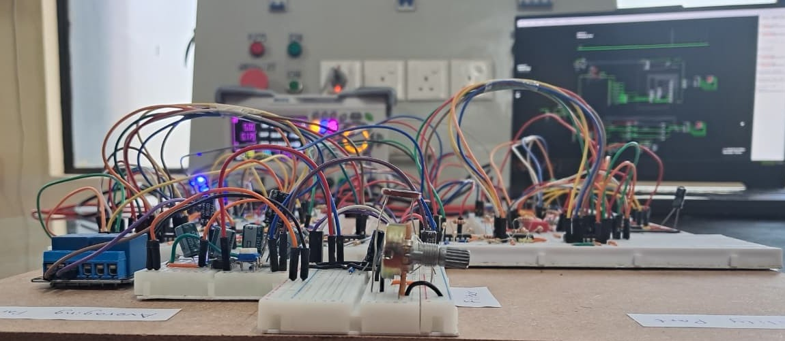
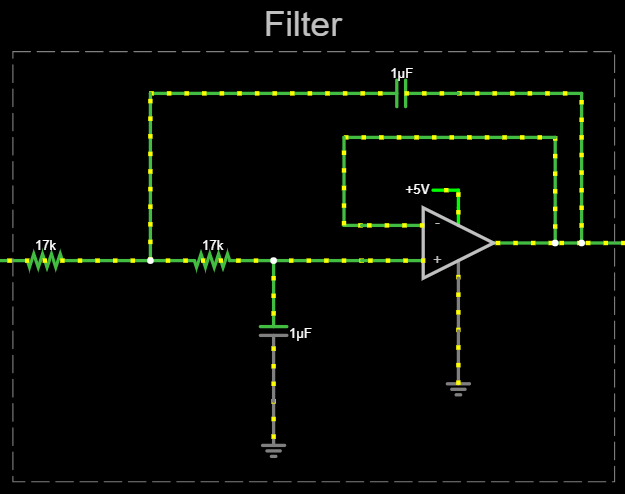
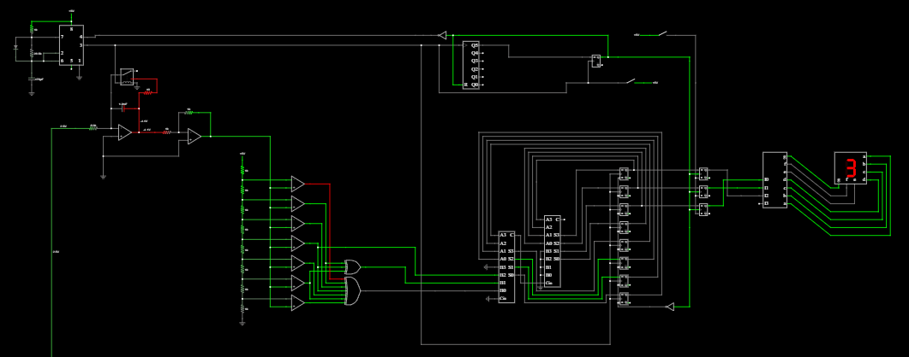
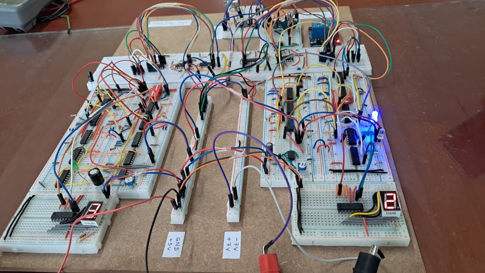

# Advanced-Light-Intensity-Indicator

A fully hardware-based ambient light monitoring and analysis system implemented using analog circuits and discrete digital logic, without microcontrollers or programmable ICs.

  

## Project Overview

The **Advanced Light Intensity Indicator (ALII)** is a digital hardware design project developed for the **EE3204 - Digital Signal Processing module (Semester 3)** at the **University of Moratuwa**.

The system measures ambient light intensity using an LDR, removes power-line noise through analog filtering, stabilizes readings against transient fluctuations, and computes both real-time and time-averaged light intensity values.  

A strict design constraint was imposed: **no microcontrollers, programmable ICs, or task-specific ICs** were allowed. The complete system was implemented using **analog components, logic gates, flip-flops, counters, and timers**.
## System Architecture

The ALII system is divided into four main functional blocks:

1. **Analog Filter**
   - Second-order Butterworth low-pass filter
   - Suppresses 50–100 Hz power-line interference
   - Preserves slow ambient light variations

  

  <em> 📷 *Screenshot: Falstad simulation – Filter* </em>

2. **LDR-Based Real-Time Monitoring**
   - LDR voltage divider with comparator-based quantization
   - 3-bit digital output representing light levels (0–7)
   - Real-time display using a seven-segment decoder and display

3. **Stability Detection**
   - Prevents false updates caused by short-term light changes
   - Output updates only if the light level remains stable
   - Adjustable stability duration: **30 s – 300 s**

  

  <em> 📷 *Screenshot: Falstad simulation – Stability and Real-time Monitoring* </em>

4. **Time-Based Averaging**
   - Computes average light intensity over extended periods
   - Adjustable averaging window: **300 s – 900 s**
   - Implemented using integrators, counters, adders, and flip-flop accumulators

  

  <em> 📷 *Screenshot: Falstad simulation – STime-Based Averaging* </em>

## Simulation

The complete system was simulated using **Falstad Circuit Simulator**.

  

🔗 **Live Simulation Link:**  
[link here](https://www.falstad.com/circuit/circuitjs.html?ctz=CQAgzCAMB0kKzgBwCZoHYBsy4oIwBYwBOIyDfEOSSkQygUwFpdcAoAJREeWORGUiIu2TP0FQJ+agmqzocVgHdhkcWFx9ukZBXV9ISlWvwUtiIWBNRDzRGD49NuO33tCDyrTv72uz347Wnv6uyEK2amHWUkRGFlG2vm4guFDQGMKwyERURHZwJmFwGGhp2uqqlVVV+qwA5sK8tIjU3E1wGhIefkQC-C09fdkZ3RFCuL2D1BO1wS3x4c7iM0F+8+AJuMULq166nXs+syreK9wC05OjyBfgVueqKVf1Kua0aJoCbx361gBOwlullMPEmwIkuDQlVYALMFnuN0e4OmUNUrAAxq94SDBEJ8B9aGUqrhtPxoPiwORIJYwIg0FJ8O5YJBUgZMYczjNLnwKDBqqzmZBMPSqMVtHA4DlikTWRwpv1WhMMNQwrJJNIumkFMFetRKYrdbRxAYGsxDVJFubpbIbOtcPZWvSKPa+qM7WBIKZ3a6bE6UjcvcsA9YACZcO3Bxjuz38EAh+gAMwAhgBXAA2ABdWLgMAhGORxmc4H0WJMCNZOIwcM6CKZqykWL9qFIaGqYApYX6NN5GF2c2qSWjO1YXY6R9gRv7oeyu-gc1wu5S8UTVCQ1+uNyRMkKWP4ofgMARDxA+SzdvWWMquBfa9ZTRK+Pbi9fn-bELzz++G1feyP+7sC39Hsu2DUYQOlX9nVA30RwdLgMCIDJRwAxCUjg-NUI0N5RgQpCwnCQCsPcGxCPQjByDQn1PHI50yMwuCwNgvpILQjBiNNWd5xY2t3HPEtI0ZcZoM8QSgNMUTLxtES3kk68v1k0Zi2mCcuCaDRrRsJpENaZJtN2JoWh0yY9NGAzHkYZJDP0yYqVUyYrNMmyWwsqJbOuXxekWK9PN2fBvB8lyhB80Z8GlTBwmScLdkNNBREYGKfS2PNdISYYQGCyhswlVSoii7gBii6QsuS1zxG4CjlV40YNAo2KMmYMBRDq3Z7SauLWoyTApL8ZwKGa5hkFq0RqtVEB30VcFxpaybnPtKxlW6gaBkQCCOrGjTgl0mMGqiJSWtG0hTBdIKY2q8FDQaqwppGgYLrmihDTOq82MVC0QBe6bvMpPx9XegYbuoIhvoar6RhsNaVvqtbmrOpqfwIcQuum0QcicRqMkh-bbufBqUefaq3rpJw3se8HRqJvxCYJM77NmwmWxpvhEMWAyGbJ262J+4zOYJ8Q7pJr9eaCr8lsBwXweSPbmDevahfe8z7vlxasOmSpKeWNWDC2I6Dpxlgv1RiRSgQBRtb8cnVt69bJwgE2XmYD6SQoh2BhJf6Wu2FIWShz2gbB4JfeBrZOcx6rPcx5hPZh8Go-az3cI9zmE8jpP5zD1Ofc5uBvvToRs8znYw5jEkuOD8ZvY9mM-b8QP-ZrmMI7L63K76uPOejgOY2TpuE6LihDwL9605jmN85rrOc7lF3mx7HMBiaNUWxkLp5BhPwPryI7HbID9BwMWE58B7bD-SwWvaHdfltnjfTvP-fL+oP1p7G7xVYv5+aIfkA-Tf+-n-rD+FFf5r3-sfD69ZgEH3AWAgYfld7Qk7hQFAW8r68hHg9GBR80GINPigsW2D659XuCfH+6D3rOxPp-PulARYnwgWQqgeDKCnVYEmQhlBmIIzzn0cYeYth3zVvgaAjUECoApIgNiOYiBznMAPARBg2GRy7grN6C0xopD4QgPeaswDoFEeSNAtJJEIRkRI+c2iFHsI+tLcQH1eE13kXqaAGh8Cbk3BkMRhiJGICkaYuRFjWHsL3urcujx7GR0cWkLAri3HrlKJ4oxPiTHODMUhaogSlEPU4STHhGiHEWOmNAHQsSNwQASd43xKT-HpMUVsBudNxBTXCfwgpKRoB0hiSUogqRynGOkVU8xNT2FIxsUIJGzStHVBVOSLp64yTiL6X4wZVRDD9moP4tR1duhbD6Bsx4cjtn1kIntQChyDbFyOYyVY9pQYpE2ZPZQNysEaPOQQjQYTli-S2as24zUnnpRYY836FN3mPysIckOBJ-kUwhUIR24dqarJOa7eO-0kXPjQJ0JKfBrpIr6Jix8D5v6dG2cCls2Kxps0eb8rFZLuoEGlHaUKnVwWrOBcsZlY1jQ-P2a7dlxFHlwO-qIAg3hSFAqvH8oVHcpzrKuf8mVCrYKTHFbKoeSFfqkImKUEkBJ-HvPVWIRkWUdW-X8ejQ1JIxVdE0tzIyj4VJawKOvaQVxKBut+KbZ1DtH44zGfjWMRUzY+vSiS0NvxPU2ECHlf8hUo2+Eqi6+WAqk1wDipLYamldrptKimkNhj6qRQeTlMZwNIo83BleRAqFApjVQqZKI1bC1RGCllPgBI0DPlGp234J5MqeH9e29t+NDAdu+gSSUxwJ1usnasDt7cmYksMIDToBJunHB0EJJE-FHjdE3d+IQo1LzsX4LRK8pwF6rFOINCgF6l2POLje7+DqgE8v9BREkUFX3KChYEA1GhfDdF-bVB1gHDDXpA++gh17HinDntcks8G4MVsefJT9p6GwsIaMgcxaUcMaqiPStDxd5K4msJiC957aKdF5IKfEmRmXZw6B0Q8OAc7MllACZDh6ay3z3nKK2btxiketOqVsK9Ta5inA2b6+6WDfTBmGRg5L4PKeUhRPg8ZkzpizMobjXAVMoYM+p29X60FJQ4es3wRzAPWAs3tNAkwo4zuKpZ9Kz4iWGyKsocEGBrO7LAz5qwjm+AOeeEFh6Hm+hecMJyz+Jzv20EZd4PayDVics3m5zL3RfO+BDX5444IQtJuKzlqwhsQ0xeUHFiinK0vdDq94DL4tqvShJL4TlGh62jpbRi1y2FDCZYJV7Dt97DXFb9KV0dwWVXBeLcErsQp22sp-Z0Ar39nqBY21Z9tkqWte3nH8pbwqwZSAgPFeSRKqwlkKu8AA+uQO7kA7sxCIHduAT3BSQCIJgYo2A7vMDu8gF7aA7tgDuwAZSTAAWwAA5pgAJYADs6gAB0ADOABhNMAB7dEABrStO2k2JuqpKyY+ajOVb1t5Qj4Gz2tHJb9J1sQ1NQeM6xFUYhHFVDJNqBU38u2u2pMcKM5c8syT0Nc4jt7Xbob3XLmMR74NunFw4YXW2xdoQOG1qX3Q5GGw+EFEdyg5HreG+thtcKyqiVJ7aFsHxWhNI2uGFsEd13N1GB7irSMqsLm8jjJGcbpLW4Ivs7l1ErklE0Go6PAFw9h-WYiyPYzmKcsd75MKaewpU6FQFRkgM6fSUfpzZTt0i-wSuXlAvG2U0l06iKiuU3lCZYTkNsbLg-qp7hQN5QmMC3fzm3XXsV4x4j+kIC130hgZTXxKLw0Y-zRUv9xPpB1mxtRhbHP5uNevd9BMNQCmJg8360i04CufvmAX5xt7k3PUvyNx3p78GT-3edFDuDK2-VdztszcERsJ2XAMUmasIoIrgCITQu+lAlgCE8gYArAjUIITQXwjQYI4KaQoU2UAAMgjnUAABYZgY4ABCfwuBBBSO9A6O6Oa8MGKoZmEgC0aIAARo0NgBokdLFHnKFNYAAB4qA-YpDOQCCDSCEQC6B8AABiCOmY9Afw9s-yVYesv0ym1M-wlMBI+YFCyQmhH4dgaIm0P4V2ChluL+EEciV+EERKT0rQRh8A9UVhEsP462O0BEmu9oBwwSDUBw74J+2h6wLh4YaKm0CQ-hx0C4K25sXEoR+G4RaCB8MRUYZULA9w6wqsGSJIZheWAU62cK8EkSjAp4qgc46gEw2cggOYMB8CKyB8OyleiwdhdREI0IB8DRvYCQP29URuTR+hfgrRXRFh9UpyNgHRC47RCQXRe+4Q-R2RbhCRgEzAtR+YVyyAZMXET8GgXEgEKxwQgQLEA0axERARexYROh5GP04xxCuxfotGqgNGzi6g6gvQx+jI0isQp4sotS2h8xGxgxVy5cvRkShRno7hyAsUQMAguEoJVR0Iii0SRg14qUYSeSESrSYisya4GQQi7hpRHoSSlRkyKysJs8zExYiwuS-CKJUybSHS6JYh9xpYZReJB43BASRJ4kNhCQbuyJLSVJuARSnSXSdJ2JOQuJFRzJBJMJ8ETWHJeIh+3JEpms6QxSsypQWJJRIp5Rfm4p8iGScJ+UMpwgy08pkSuiLi6JmJ9JOJmp+JOpbJqkhhCQwKxprSuinatAlpGpTJ5ACpli+YPYB+CJ4QAZEykSQiIi7pwpjJYp3pOp1E-pEEVkymLufppgFqiROkf+UpIINaiZaUOEPYCRuZw8cZpm4YsGBCKZ149UiZyZepNyZZE0YMsIiZnK6Z14Ocd8ICLZCZ5kFqkCDZqkcUuZ9anZzZ5kaUbZ3Aaco5A5U51ZCsHZ-GY5jZs5omS5q585dB3Rf8VkPYVk8unZlYNZM+5knsi8GobYq8JZBmPYbEQZr8JEPY4I+YbwFkhxepT6L54QT6+ZR0Isd5awFZdZ20AFV+QFBZpgoFD515Zh3ww+oFQqX58EmuoFz5CF0F8Er5n5qF75r5VsSF5UQFeFIFeF+2BFt5xFRFecgxWFaCpo+520+5rodm3qUgio20HoR0t8tsmUwabF4YqkjFRsEg-OamzYBpy+12EUP4zJ9pi0x+BmzkpJili0yl-p5ZfEQZBpGFYl6iVY7+54Bl+lTgVE14HhJJmwplulWuUlgRmldltlbOIU5kQZOZvkblymNa8uNgri9UtwjltwIUXl20vlgFvk454kAw3AFZNe0VBmUVo0IUCVUVyl+p4VjOjOzsklslbOymFCVl-FVY9UClRVvkVypVym5VAZzl7F4kwVMV+VmVqZV4NV5sTVbVLUx8IstIf5MVXlIsoVWgi0PVYVnlUMZFMxMer5JhAcnM2hTcpx2xfgw28UQc8x3ywQK1FWkIBwG1685V7WTgK1h1oYy1HhIuZ1mghsmmiYqYmY2YUmkcesT+0ss8T+5YBglYBAeFAB0sP16B4l4mcgHY+19ReWOYB132k465Ds5V1csN9Ru6-QVAbIoNU+aNYuy4hR9GBR5IfmaanB5gjIFIbxHGLUokV+XlFNP+d4lMEEh0dN1ZqhBMxFXl3xUNHsz14N7Nbh7NCsPNouEN4Q8NayQBxaPqrQItai8UVOotMtiwV2zMnNV1Qcnsq1w+C1Ut5ke1CNYtUM8x5gJ6utm+ioBtxo5Nb14NTQV+bh1tJ1DUFOn6ysiFnhIJvRu6Mcpen80sGhn8KxZ268q0SSLyR0S4Egg0b2j2z2c4ZA72n2uAAOCdwOEdYOd2AAggAG6yFJh1DI5o5Y644E4moaKl5EpbAixl3aB9Q2rar+gpWvjaFEoCDGqCplRl1q1Cqwo3nOjS2d2rJvTXbTBq0LxIql5qTOEj2PIT1ljOF92t1BkyTD0tWj3SXTDe3M6rLr1Xg5hZUYVcIGZtbD0V4LXJCQg-jJDbL9GdYjKcqX0yVtYjIX2rJX0yT9SiSX1xQST9R5nP1xRpQLU-2PJq3-0D1z2CFlRqTAOJb70WTb3ANbYAMfrFaEXXLwOPj+GBCX0U5PqQgU6yzP14M3YJD4OPL9Fl3+EOGoZt2vgYOa6cUCVxVRj6THzHzEKT7SxcVHT3CSXoZtG9G9XTTnUuXsUe1KhGitBpTb7cCoQ8iDbVn8BRHk3skKPFXKzbQEgJGIoWYrVgB9Y6SviyjaMHDSqclwZzrGO2JRVvRAYHBgAKZRV2N1wrVPrWI-mjrGM96M4prHW7JRUGo2NOA2R+PhbEoOD9wDAYXWKqIOPFrWKON-QSOJauMVTBPHDWIrDpOmWZPrJWMppROeMYZugqiWPFN5MRPhOlOrDxMtifzL7OGjTS2JWGDS31mNNBG0BeUKYLl1zmG6OhbdV34AJ9M0IoKrAALwaDUq7NN5ZCod0YVzMUDAMe3KBLPNg1qBWjoyVioU5gPIPSp4N37INEph2KFTrn3Pj+HDPdCXMXNt1GYjLkwFntMPONJCER7bY-QYyrTFojIUQUxLFzpVpjRvApppZVgP5PPdRTT5hhJvOgtmHziNzFr-M5G+0EKG2NEYugt3MWA4xnmGBgv1jxPgvovORqL+VqLXMItIT-nFljS+2+CqYzXAsETyo4xDGm5cTDM6N371MFQHBNOct+WIwCvvPOH1nHWxPlW1QHBJN-OhPqL64zNirGMYV7OnAXXKYYU3OPiatXM-IONlgoEWQhMqzd0Ng7M6V7npTyNFPu1O6VNayQZX6PD1kutqiThtiajJhpjo70C7B+NqxMPuvXKl7BKgnn7LP8AaHhsaF+4RtAEeal6X6I1O5ll5rhDrCMLpsBv2vPp5vdBq2GzS1+5x5gWPzn7L6Q1b6ZtVu1sVvo2wxQyei1X8M2gACSzQbbHO5bEmvF2U9toVTsdVGQJ4rmg7Gru9ug-bkyeWwzw7qkz4tsqygg+jj4br+rjyG7BjwMt9qybrnWo0SZdcbsjOcGlrbyq7BmmEixoV2yt7N7OMk9DYT7RrEDprmrb0nh1jK7c730nh8T2yQbODQbgHK7vZ-7QbP7D65kNenh3yFmJbz4zhhsqQ-O2bm+ecFOPhYz2HVys66tuHKtGQJbsTcbGKu1gzeHYy3hVyTqCAzjBUzEyuLFDHorqeEjywhj2UkrnUnC-73HbHMefUzEH6gnCrHH6iLA1ywHH6asLuOjKqtjplOj+KArdH7jnwVeHhmZx1TU51BCx1MYqn5jmgvgw2y+U0YUnQCnNnnUNGajnDjolbi0MbLbPbTtc6LnXbvbQHe58qVdBm0DgXJrurT5plVqqZJYerEXIXakerzw6OCrmHY0URdHKQIAPrfrzTcNyH5HaT+X70bnbMnAwdKXEiXo6XgNy8wN2YMjXEgQ+ErBsY+AhgUufDxLye4ABn4Az1BC7X9ZJz9ZOWHhc1tCRmCR9Zixw34GpcnMqmUzemDXrrIsGzS3flAQ45CDShSE7LGnU9Xk4wXtCDq3K3kFdL-ljX5klLbXwMBI1T3UwzYFvXYTVTYb30YdKaI1LsSAXoVTIscKijOWIc70vgX3Xa-cyxBCn8cKtW3U8xFUUPqw4rCmYPyPy3gPtrsW45SIwMa34jzXT3mD2PiTugpebjPmePuP9h+2RPSQeLRmJzT6JzlD3XnwSQzHW26EgQ6Ey+vP4lGVuwSM0tQeVOU00tU0Gee+FbktuyXX8UcvV1uyUbLEZbhocejEInTuDuiUFEcEoK4AIqgVhINXEgWX-rDW0omWnWF1OW-EqE+vtvrAAdvCNGrsA+KICdUdL2TscdMACdgOwOO1qdEOGYSYTB0hCOGYAAnhjtjnjoTtVrhqhIe91nphrqEKrFtkHg-h2vthTFZEfhp0Y5oKFVfTe+lus9ZhAccAUEgaFtw2n5QI3-Z6X031EyU-FfD7k4-B491Ip+2sY4ljfahG-U32P2kjM+P5-aP3FGPDlgNVct94A798ICn+OdP-YR9xXcWt92PN9wpUB7Bxn13zJ8f7-MZnXiF7JYO8F-6XJ0+SExhzh8-+84VRM90+lp-+-5Pj-xQIVYigaAACeQEVG1NhlLgkZOGYAlRhhhWCvxpojtdzrjGbZsxO2wSRlEvE9byB+06UNhuShC6ec-OTnL2P528aUddW2tO-PB1fBBtvkSXaFp52kTEDpgmXJML63oBygGB7nNALQnc7nkgaWobMDwJ+iMU-GkYcwOsgy4wAmwsAH0nIFJCuhYA-CU8DIAlghE-G9DMXMrHa44cGojFfbubD3IUJbwUYRLAsRSLGCUi3KU0N2Eq5kk9ytmJ1DigTSoQRiCcHpDQC9Q4owoI4NWF2FjB2xaiFMYrPXm-hlhA0OAtwa4K-C9wCW5nBuOvmOD94Lm0oXfKwCS4K91k2tPoPPwy7m90h6NCXkvEXKsD2BBQ8fErBXzQFoapQ7LhkL9BltAIGvM3mwLqGxFn0rQQCFLxaFlD6hwWL2lXh5g9DsungUXlMX6HERaQ-AHACAAkKsh0oW4CxH4BAAAA1JMKQXD5ph6AGOdgJQQRzo4MwOOOQlMMGjUA5hDBXnGUSDapA1hfwHYXsIOFHCMcjADHKH3D6R8Y+CBCwFgFmHzDVQYSYgArFWHrD7h6OfYYcLuHo4Xh6OTOvnWhEAAVBHNDlkJfD+AFEc4Yfg9AqgUaioYEZCN2FgjHhkI6EbCOeEY522SODMPQDqB-AkwEI1gEAA)

> The simulation demonstrates:
> - Noise suppression in the analog filter stage  
> - Real-time light intensity quantization (0–7)  
> - Stability-based update logic  
> - Time-domain averaging and separate averaged output display  

Simulation files included in this repository correspond to individual functional blocks and the integrated system.

## Appearance

  

## Repository Contents

- `/simulation/` – Falstad simulation files for individual subsystems and full integration  
- `/report/` – Project report detailing design methodology, calculations, and results  
- `/figures/` – Circuit diagrams and block diagrams used in the report  
- `README.md` – Project overview and documentation

## Design Constraints

- ❌ No microcontrollers  
- ❌ No programmable ICs  
- ❌ No task-specific ICs  

✔ Allowed components:
- Logic gates  
- Flip-flops  
- Counters  
- Timers (555)  
- Operational amplifiers  
- Discrete analog components

## Applications

- Energy-efficient lighting systems  
- Smart infrastructure and public lighting  
- Hardware-based sensor monitoring  
- Educational reference for discrete DSP-oriented hardware design

## Academic Context

Course: Digital Signal Processing  
Department: Electrical Engineering  
University: University of Moratuwa  

This repository is intended for **educational and demonstration purposes**.

